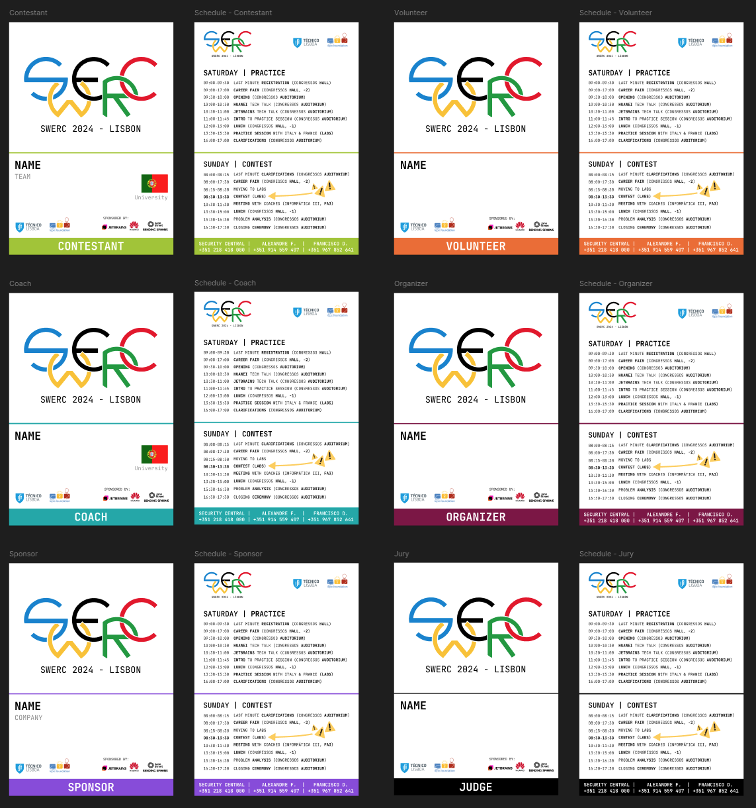

# SWERC - Lisbon 2024 Badges
The badge designs were created in Figma.

To populate them with names, the [CSVPopulate](https://www.figma.com/community/plugin/875365065394448755/csv-populate) plugin was used in Figma.

## Data format
Badges only have `Name` and `Role`, while contestants also have `Team` and `University`.

### Splitting data
You must split the input CSV by role, as the badges differ.
For that, you can use [filter-by-role.py](./data/filter-by-role.py).

The input CSV is expected to have the following columns: `firstName`, `lastName`, `role`, `teamName`, and `instName`, and is expected to be named `all.csv` and placed in the [data](./data/) directory.

The output is multiple CSV files that will allow you to import to Figma with the plugin.

### Contestants and Coaches
Both roles include team country and Contestants also have the team name.

For that, use [filter-by-country](./data/coaches/filter-by-country.py) and [filter-by-country](./data/contestants//filter-by-country.py) to split the Coaches and Contestants by country.

You have to place `Coach.csv`/`Contestant.csv` file in the script directory as well as a `teams.csv` file where each row represents a team.

The teams CSV file is expected to have the following columns: `teamName` and `country`.
